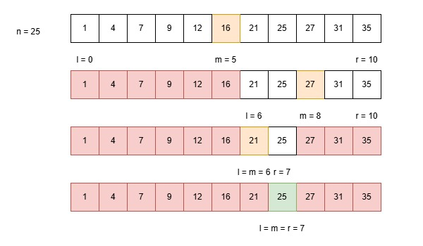

# Search and Selection
## Search

**Search algorithms** are used to check if a value is present in a data structure. The simplest search algorithm is **linear search**: check each element in order until either the value found or all elements have been checked. This has a **time complexity of $O(n)$**. However, if the list is sorted, there is a faster way of searching for values.

### Binary Search

**Binary search** works by using the **divide-and-conquer** principle. It iteratively splits a list in half until it finds the desired value, or it is determined the value is not in the list.

The only prerequisite is that the list is sorted in ascending order.



#### Code
```py
def binary_search(array: list, value: int) -> int:
    l, r = 0, len(array) - 1
    while l <= r:
        m = (l+r)//2
        if array[m] == value:
            return m  # The index of the value
        if array[m] > value:
            r = m - 1
        else:
            l = m + 1
    return -1  # If the value is not in the list
```

**Time Complexity: $O(log_{}(n))$**\
**Space Complexity: $O(1)$**

## Selection

**Selection algorithms** are used to find specific values in an array, such as the $ith$ smallest value.

### Quick Select

**Quick select** is a recursive algorithm for selecting the $ith$ smallest value in an array. It is similar to quick sort in the sense that it partitions a list about a pivot. However, it uses the rank of the pivot to choose which partition to pass into the recursive call.

#### Code
```py
def quick_select(array: list, i: int) -> int:
    if i > len(array):
        raise ValueError("'i' is greater than length of 'array'")
    i -= 1
    if len(array) == 1:
        return array[0]
    left, pivot, right = partition(array)
    k = len(left)
    if k == i:
        return pivot
    if k > i:
        return quick_select(left, i+1)
    return quick_select(right, i - k + 1)


# Simple partition function - pivots on last element
def partition(array: list) -> tuple:
    pivot = array[~0]
    left = [x for x in array[1:] if x < pivot]
    right = [x for x in array[1:] if x >= pivot]
    return left, [pivot], right
```

**Time Complexity (Worst-Case): $O(n^2)$**\
**Time Complexity (Best-Case): $O(n)$**
